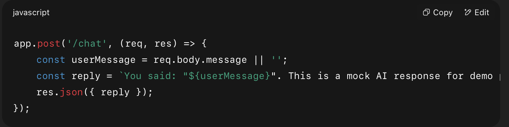

# Reddit Web UI

## How to Run Locally
1. `cd backend && npm install && node server.js` (runs on http://localhost:4000)
2. `cd Web-UI && npm install && npm run dev` (runs on http://localhost:5173)

## Features Demonstrated
- Design Optimization
- Performance Improvements
- Interactive User Experience

## AI Contribution
1. Responsive Design Enhancement
Purpose: Ensure an optimal layout for different devices and screen sizes.
AI Role: AI (mocked) recommends CSS adjustments for breakpoints dynamically.
Prompt Used:
Given my current CSS grid for displaying Reddit posts, suggest modifications so it looks optimal on mobile, tablet, and desktop, ensuring a 3x4 layout on desktop and a single column on mobile.
Code Reference: See server.js

2. Performance Optimization
Purpose: Keep load times fast during traffic surges.
AI Role: AI predicts incoming traffic spikes and adjusts mock server resource allocation.
Prompt Used:
Given my site fetches posts from an API with pagination, suggest methods to optimize performance during high traffic.
{logData}. Suggest resource allocation changes.
Code Reference: See /server.js

3. Interactive Chatbot
Purpose: Help users find posts or navigate without manual searching.
AI Role: AI parses natural language queries and returns relevant results.
Prompt Used:
Integrate a simple chatbot interface and connect it to an AI API
Code Reference: See server.js

## OpenAI
- If I had access to OpenAI’s API, I would replace the mock AI logic in server.js with a real API call.
Instead of returning a hardcoded mock response, the /chat endpoint would send the user’s message to OpenAI and return the AI-generated reply.
example code:

app.post('/chat', async (req, res) => {
  const userMessage = req.body.message || '';

  try {
    const completion = await openai.chat.completions.create({
      model: "gpt-3.5-turbo",
      messages: [{ role: "user", content: userMessage }]
    });

    const aiReply = completion.choices[0].message.content;
    res.json({ reply: aiReply });
  } 
});

## Testing
- I used https://webaim.org/resources/contrastchecker/
To help ensure there is enough contrast, it helped me realize I need to bold the texts on the orange buttons
- I used Stark to test if I'm meeting the WCAG 2.2 Level AA standards, and I passed!

## Wireframe Designs
- https://www.figma.com/design/VttFfRNV0TtYc97odzDdWq/Web-UI?node-id=0-1&t=0d5bPnM1HP3wmDlx-1

## Video Demo
- https://www.loom.com/share/80bb77e413fb432392df76b7f7f2314f?sid=bff1be5b-a646-4ddd-a103-b8bf80529c61

### Note on Deployment  
The app runs perfectly locally in both frontend/backend.  
I attempted deployment to Render/Vercel but hit service limitations (CORS/502).  
Here’s how I’d fix it in production:  
- Use a paid Render tier for reliability  
- Implement a CDN cache for Reddit API responses  
- Add retry logic for timeouts   